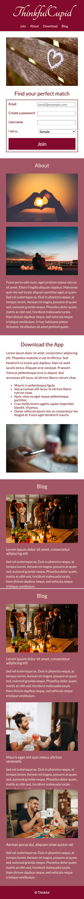
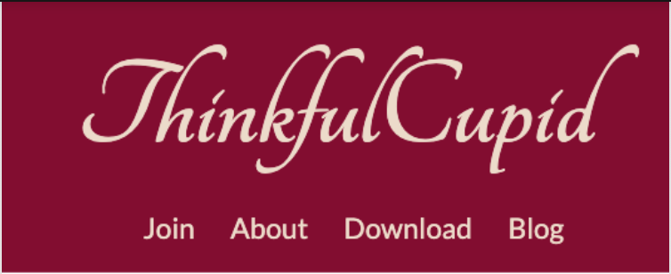
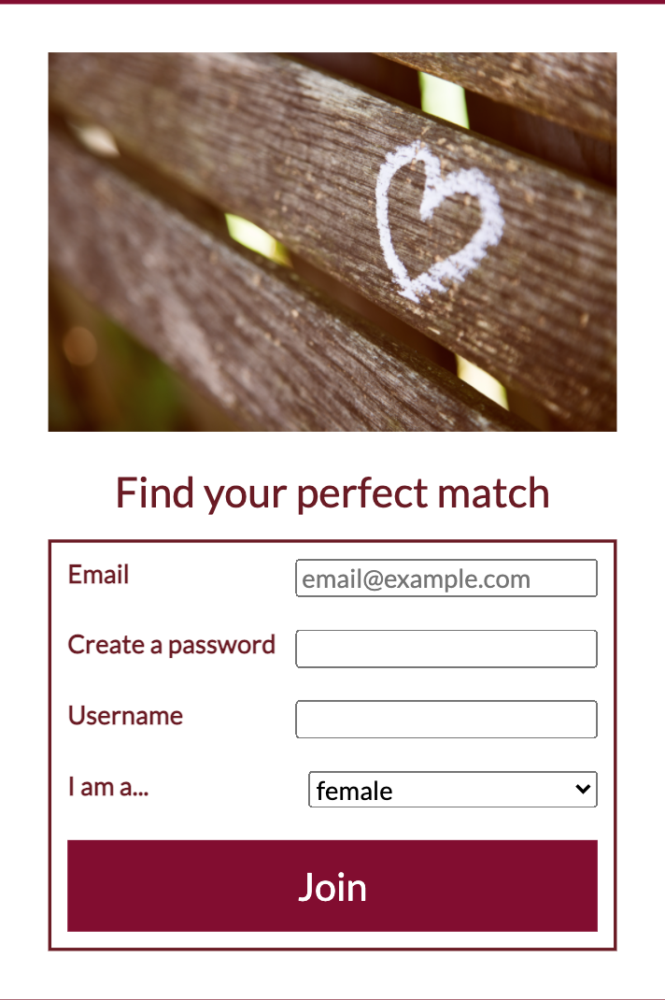
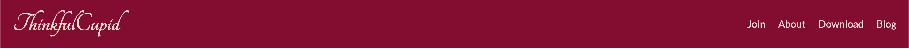
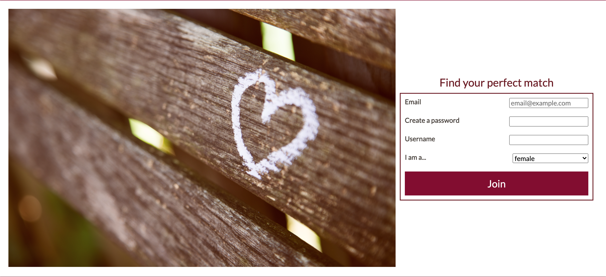

# ThinkfulCupid

ThinkfulCupid is an online dating and matchmaking website that allows people to meet, date, and network with each other. ThinkfulCupid uses a special algorithm that matches people based on their personality types. It also allows matches to connect with each other regardless of their locations via video conferencing.

For this assignment, you will implement ThinkfulCupid's landing page in HTML & CSS.

## Thinkfulbnb views

The UX designer provided you with the following user interface mockups:

### Mobile view

### Desktop view

### Existing files

| File         | Description                                                             |
| ------------ | ----------------------------------------------------------------------- |
| `images/`    | A folder containing all the images used for the design.                 |
| `index.html` | The starter HTML file. You will need to add your solution to this file. |
| `style.css`  | The starter css file. You will need to add your solution to this file.  |

You're encouraged to spend some time studying the provided files.

### Setup

Use VSCode Live Server to launch the `index.html` page in your browser.

### Tasks

For this assignment, you will be following a mobile-first development approach. To pass this assignment, you must complete the tasks detailed below.

You **should** use flexbox, and **not** floats, to achieve the desired layouts. The `.group`, `.item`, and `.item-double` classes are provided in the CSS file for your convenience, but it is not necessary to use them.

You are **NOT** expected to match the designs pixel by pixel, as long as the required layout is satisfied.

Edit the `index.html` and `style.css` as needed to achieve the following requirements:

#### Navigation

- The logo should stack on top of the menu links, which are aligned horizontally, as follows:

- **Single-page navigation**: Modify the navigation links so that clicking on each link will take the user to the corresponding sections on the page, as follows:

| Link clicked | Take the user to the section with `id` of |
| ------------ | ----------------------------------------- |
| `Join`       | `id="join"`                               |
| `About`      | `id="about"`                              |
| `Download`   | `id="download"`                           |
| `Blog`       | `id="blog"`                               |

#### HTML form

- In the "Find your perfect match" section, create a form that contains the following input fields with the specified types:

  - `Email`: `email` input type, with a placeholder value of "email@example.com"
  - `Create a password`: `password` input type
  - `Username`: `text` input type
  - `I am a...`: a dropdown list with the following options:
    - female
    - male
    - other
  - a `"Join"` button

- Some CSS styles have already been written for you to help style your form. Add CSS to the form so that
  - the labels (i.e., "Email", "Create a password", "Username", "I am a...") and their corresponding form fields are aligned towards the opposite ends of each row

Your final form design should look as follows:

#### Vertical content alignment

- The content in the remainder of the sections (i.e., "About", "Download", "Blog"), including any text and images, should stack on top of each other. Refer to the mobile design shared above.

#### Responsive images

- Write CSS for all images so that the images will match whatever container width they are placed within, and changing the container sizes will update the image sizes appropriately.

#### Media query: Desktop view

Now that your mobile design is looking good, you will need to adapt the design for the desktop view.

- In `style.css`, create a media query that applies CSS rules for screens that are wider than `768px`.

Within the media query, write CSS to create the following designs for desktop:

- The logo and the navigation menu links should be spaced apart from each other, like this:

- The "Find your perfect match" form should be vertically centered to the right of the image, like this:

- The items in the "About" section should be horizontally aligned. The paragraph content should be vertically centered and always be twice as wide as each image item, like this:

- The items in the "Download" section should be horizontally aligned, and the paragraph item should be as wide as the image item, like this:

- The blog posts in the "Blog" section should be displayed in a 2 by 2 grid (see the desktop design shared above)
